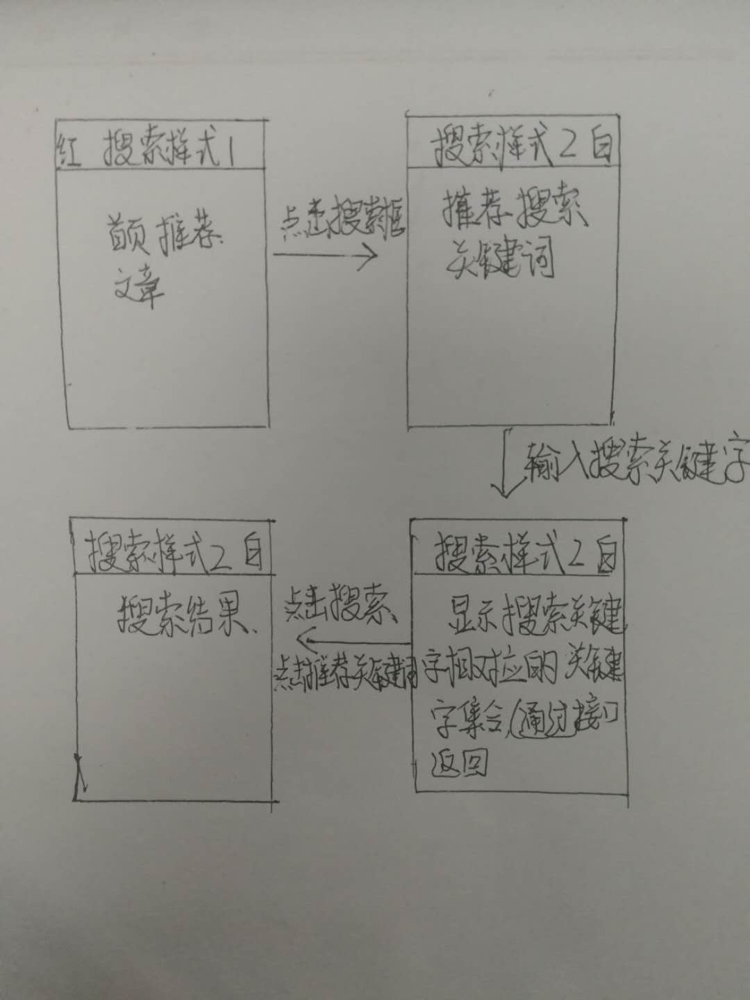

### 玩转前端-北邮-字节跳动训练营项目：简易版今日头条搜索

2020-07-17
by 许楷沂


一、功能详情
- 功能描述：
  - 搜索框：支持用户手动输入词、并基于ajax实现推荐词功能。
  - 结果页：通过ajax获取搜索结果数据完成列表页渲染。
  - 详情页：通过路由跳转并且带参数显示详情数据。
  - 滑动加载：实现swiper对搜索结果页tab横向切换，显示加载动画。
  - github-Pages部署：通过github开放功能静态页面的展示，部署该项目。
- 实现要点：
  - 前端UI界面实现，熟练运用html、css。
  - 实现网页交互功能开发，熟练运用js、ajax等。
  - react 组件化开发。
  - react 路由加载。
  - swiper的使用，页面逻辑的实现。
  - 反向代理：实现react跨域请求数据。

二、实践过程
- 首次的误打误撞之：界面架构设计
  - 逻辑设计过程：
  作为一个用了6年今日头条app的忠实粉丝，首先我便去观察了今日头条的界面架构。它现在的版本便是，搜索框是有两种demo，并且搜索界面也会随着搜索框的点击而发生改变，对此我总结了一下4种情况：
  <!--  -->
  
  对于这4种样式，一共可以分为4种情况进行显示我们的结果列表页面，于是搜索框的部分共有2种样式。
  - 单界面与多界面（路由跳转）的选择：
  通过浏览发现，每次头条的点击搜索功能其实是很快的，没有多余的等待时间，这引起了我的思考，对于我的项目的实现，是单界面的重新渲染比较快还是进行路由跳转的方式比较快呢。通过实践发现，单界面的重新渲染实际上是比路由快了一丢丢。所以这里我便设置了单界面的模式。（后面详情界面仍用到了路由的跳转。）
  - 变量的定义：
  单界面的情况下，针对上面的4种情况的判别，我们设置了两个变量，分别是搜索框的变量控制，还有一个是结果列表的渲染显示。根据两个变量去渲染不同的单界面内容。
  ```
    SearchType: false,//搜索框样式：false:初始状态（无查找）true：查找状态
    listType: 0,//列表界面显示：0-推荐界面 1-推荐字界面 2-实时搜索返回关键字界面 3-查询结果界面
  ```
  - 思考：这里的单界面模式会引起界面的重拍重绘，实属不好。。。
- 组件化开发
  基于上面的界面架构设计，这里将几个界面设计成了组件,首页通过判断应该调用哪个组件，从而渲染该组件。
  - 搜索框的组件设计
  ```
  <div className="searchBG">
                        {/* div搜索框 */}
                        <div className="searchBox" onClick={this.gotoSearch}>
                            
                            <span className="content">上海杉达学院图片|延期毕业无法参加社会实习</span>
                        </div>
                        {/* 发布按钮 */}
                        <div className="publish">
                            
                            <div>发布</div>
                        </div>
  </div>
  ```
  - 搜索列表页面的组件设计
  ```
  <div className="swiper-container" style={{ display: this.state.isLoading === false ? 'block' : 'none' }}>
                    <div className="swiper-wrapper">
                        <div style={{ 'marginTop': '55px' }} className='swiper-slide'>
                            {searchArr}
                        </div>
                        {/* 加载中的显示效果 */}
                        {elsePages}
                    </div>
  </div>
  ```
  - ps：后面发现对于组件的封装实际上还可以更好的继续封装，但ddl不允许了，便先如此。往后继续更新。
- 总有些惊奇的机遇，比方说当我开始碰react。
  - 由于之前碰vue的比较多，没有机会碰过react（实际上早就想碰一下了）于是我便趁着这次的搜索简易版项目，顺便上手学一下react的相关知识。
  - 虚拟DOM和diff算法
  从react的虚拟DOM和diff算法入手，发现实际上react和vue用的都是虚拟DOM和diff算法，虽然有些差别，但也实际上是大同小异的。
  对于react的diff算法比vue的diff算法间接一些：
  react的diff算法只用了两组指针，分别对于新DOM与旧DOM进行比较从而更新虚拟DOM再进行渲染。
  **注意**：对于React的diff算法，尽量不要将最后的节点移动到最前面。于是对于界面DOM树的设计我一直把这个点放在心里。
  - JSX的写法
  一句话，将HTML写在js里面。好像很容易接受的样子。。不过就是对于js文件来说，，有些的复杂，内容比较多，看的也不容易。
  - 组件化开发
  与vue相比，react的组件化开发的参数传递比vue的简单些，直接通过props进行传参即可。其余大同。
  - 路由
  路由其实与VUE的路由并不会差别太大，但要注意的点是如果没有标记路由的界面，要通过withRouter进行声明，这样子路由便可以跳转到相应界面。（PS：这个在列表的组件化开发中使用到。）
  - 还有很多东西。这里不一一列举。

- 进阶功能之：swiper的运用与加载动画的使用
  - 加载动画的使用：
    
  设计9个cube盒子，然后通过css animate让每个盒子跳动的时间不一样，从而达到这种效果。
  - 加载动画与swiper
  通过调用swiper.js的onSlideNextStart与onSlidePrevStart进行滑动前的初始化，滑动的时候便显示加载动画，直至请求数据完成渲染后，便隐藏该动画。

四、进阶功能 ：页面性能优化
- 功能描述：通过性能分析方法学习，开发实现相关优化逻辑（可从多个常见指标纬度开展策略，比如实现图片懒/预加载、pwa等）
- 实现要点：
  - 通过chrome工具进行页面性能分析，对比优化前后的优化结果。
  - 编码实现常见的性能优化逻辑，可以考虑从FCP、load等指标（开放题）

